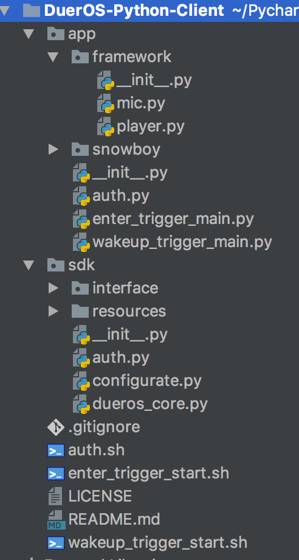

# DuerOS-Python-Client使用说明
文档参考
* [《Step by Step带你玩转DuerOS - Python DuerOS SDK[Ubuntu平台] (2)》](http://open.duer.baidu.com/forum/topic/show?topicId=244631)
* [《Step by Step带你玩转DuerOS - 内容目录》](https://dueros.baidu.com/didp/forum/topic/show?topicId=244800)
## 运行依赖
* gstreamer1.0
* gstreamer1.0-plugins-good
* gstreamer1.0-plugins-ugly
* python-gi
* python-gst
* gir1.2-gstreamer-1.0
## 测试环境
* Ubuntu 16.04
* Python 2.7.12
## 使用说明
### 项目获取
通过git下载代码到本地

    # git clone https://github.com/MyDuerOS/DuerOS-Python-Client.git

### 认证授权
在DuerOS-Python-Client目录下执行
 
    # ./auth.sh

### 通过[Enter]键触发唤醒状态
在DuerOS-Python-Client目录下执行

    # ./enter_trigger_start.sh

然后，每次单击[Enter]键后进行语音输入
### 通过[小度小度]触发唤醒状态
在DuerOS-Python-Client目录下执行

    # ./wakeup_trigger_start.sh
然后，每次通过[小度小度]进行唤醒，然后，进行语音输入

 
## 代码结构
DuerOS-Python-Client代码结构如下图所示，

其中，

*DuerOS-Python-Client:项目根目录*

* DuerOS-Python-Client/auth.sh:认证授权脚本
* DuerOS-Python-Client/enter_trigger_start.sh:[Enter]按键触发唤醒脚本
* DuerOS-Python-Client/wakeup_tirgger_start.sh:[小度小度]触发唤醒脚本

*DuerOS-Python-Client/app:应用目录*

* DuerOS-Python-Client/app/auth.py:认证授权实现模块
* DuerOS-Python-Client/app/enter_trigger_main.py:[Enter]按键触发唤醒实现模块
* DuerOS-Python-Client/app/wakeup_tirgger_main.py:[小度小度]触发唤醒实现模块
* DuerOS-Python-Client/app/framework:平台相关目录
* DuerOS-Python-Client/app/framework/mic.py:录音模块(基于pyaudio)
* DuerOS-Python-Client/app/framework/player.py:播放模块(基于GStreamer)
* DuerOS-Python-Client/app/snowboy:snowboy唤醒引擎

*DuerOS-Python-Client/sdk:dueros sdk目录*

* DuerOS-Python-Client/sdk/auth.py:授权相关实现
* DuerOS-Python-Client/sdk/dueros_core.py:dueros交互实现
* DuerOS-Python-Client/sdk/interface:端能力接口实现

## SDK接口说明
### 授权模块(sdk/auth)
#### 授权接口
用户通过授权接口完成基于OAuth2.0的认证授权流程

    def auth_request(client_id=CLIENT_ID, client_secret=CLIENT_SECRET):
    '''
    发起认证
    :param client_id:开发者注册信息
    :param client_secret: 开发者注册信息
    :return:
    '''

### DuerOS核心模块(sdk/dueros_core)
#### 启动DuerOS核心模块
DuerOS核心处理模块启动

	    def start(self):
        '''
        DuerOS模块启动
        :return:
        '''
#### 停止DuerOS核心模块
DuerOS核心处理模块停止

	    def stop(self):
        '''
        DuerOS模块停止
        :return:
        '''
#### 触发语音识别状态
DuerOS核心处理模块进入语音识别状态（唤醒后触发）

	    def listen(self):
        '''
        DuerOS进入语音识别状态
        :return:
        '''
#### directive监听注册
通过监听注册接口，用户可以获得云端下发的directive内容

        def set_directive_listener(self, listener):
        '''
        directive监听器设置
        :param listener: directive监听器
        :return:
        '''

## App接口说明
### 录音模块(app/framework/mic)
#### 开始录音
录音开始控制

	    def start(self):
        '''
        开始录音
        :return:
        '''
#### 结束录音
录音结束控制

	    def stop(self):
        '''
        结束录音
        :return:
        '''
#### 录音接收实体绑定
将录音组件同，duersdk进行绑定

    def link(self, sink):
        '''
        绑定录音接收实体
        :param sink: 录音接收实体
        :return:
        '''        
#### 录音实体解除绑定
解除录音组件同duersdk间的绑定

    def unlink(self, sink):
        '''
        录音实体解除绑定
        :param sink: 录音接收实体
        :return:
        '''
### 播放模块(app/framework/player)
#### 开始播放
开始播放控制

      def play(self, uri):
        '''
        播放
        :param uri:播放资源地址
        :return:
        '''     
#### 停止播放
停止播放控制

    def stop(self):
        '''
        停止
        :return:
        '''
#### 暂停播放
暂停播放控制

    def pause(self):
        '''
        暂停
        :return:
        '''
#### 恢复播放
恢复播放控制

    def resume(self):
        '''
        回复播放
        :return:
        '''
#### 播放状态监听注册
注册播放状态的监听器

    def add_callback(self, name, callback):
        '''
        播放状态回调
        :param name: {eos, ...}
        :param callback: 回调函数
        :return:
        '''
##### 播放时长
当前播放音频的播放时长（模块属性）

	@property
    def duration(self):
        '''
        播放时长
        :return:
        '''
##### 播放位置
当前播放音频的播放位置（模块属性）

	@property
    def position(self):
        '''
        播放位置
        :return:
        '''
#### 播放状态
当前播放音频的播放状态（模块属性）

	@property
    def state(self):
        '''
        播放状态
        :return:
        '''
### 工具模块(app/utils/prompt_tone)
#### 提示音播放
短暂提示音("du")播放

    def play(self):
        '''
        提示音播放
        :return:
        '''
